# The Five Loops of Agent Intelligence

People talk about agent capabilities as if they come from one place — the model. A smarter model means a smarter agent. This is true in the same way that a bigger brain means a smarter person: technically correct, but missing most of what makes intelligence useful.

In practice, agent intelligence emerges from five nested loops. Each loop multiplies the one below it. Skip a loop and you don't get a slightly worse agent — you get a categorically less capable one.

## Loop 1: Token Generation

The LLM processes input and generates output, one token at a time. Pattern matching, next-token prediction, compressed world knowledge — whatever frame you prefer. This is where raw intelligence lives.

But raw intelligence without structure is just a very fast word predictor. The token generation loop, by itself, produces completions. Not solutions.

## Loop 2: Conversation

Wrap the token generator in a conversation — a sequence of messages where the model's own output feeds back as context — and something qualitatively different emerges. The model can reason through multi-step problems. It can reflect on its own output. It can plan.

This is what "chain of thought" and "thinking mode" exploit. Not a new capability in the model, but a new loop around it. The model talks to itself, and in doing so, thinks.

The biggest progress in reasoning came not from architectural breakthroughs, but from asking the model to go "step by step." Five words. Chain-of-thought reasoning, unlocked. A loop, not a feature. This pattern — profound results from simple structural changes — repeats everywhere in AI.

## Loop 3: Tool Use

Give the conversational agent access to tools — a file system, a code interpreter, a search engine, an API — and it breaks free from the closed world of its own knowledge. It can gather information it wasn't trained on, execute actions that change state, and verify its reasoning against external reality.

This is the loop that turns a chatbot into an agent. The model reasons, calls a tool, observes the result, reasons again. Each cycle brings new information the model couldn't have generated from its parameters alone.

But the tool loop is only as good as the tools available. This is where context engineering begins to matter — the tools an agent can access define the boundary of what it can accomplish.

## Loop 4: Context Update

Here's where most agent systems stop, and where the interesting design space begins.

The first three loops operate within a single session. The model thinks, uses tools, produces output. Then the session ends and everything is lost. Next session starts from zero.

The fourth loop is about what persists. How does accumulated experience carry forward? How do the lessons from one task improve performance on the next?

This is the domain of skills and memory. A skill isn't just a tool — it's a tool that accumulates knowledge through use and refines itself over time. Memory extends this further — searchable history across sessions, with mechanisms for the agent to curate its own working context.

This loop turns an agent from a stateless worker into something that develops institutional knowledge. The difference between a temp and an employee.

## Loop 5: Time

The fifth loop is the most important, and the most misunderstood.

AI has no native sense of time. It takes time to generate tokens, but the model itself doesn't know how long anything takes. It doesn't experience waiting. It doesn't feel duration. With enough compute, loops 1 through 4 can happen as fast as the hardware allows. AI lives in a world where time doesn't exist.

But the human world runs on time.

You push a package and wait for a remote service to update. You send an email and wait for the person to respond. You deploy code and wait for users to interact with it. You build a companion and it needs to exist across someone's days, weeks, months — not just their prompts.

No amount of compute can compress this. Even with a supercomputer that completes any agentic task instantaneously, you still have to wait for the physical world to change. For the build to deploy. For the person to read your message. For the market to react. For the sun to rise.

**Time is the irreducible interface between AI and humanity.** It is the tool AI must learn to use — the way it uses a CLI or a file system — to truly participate in the human world.

Scheduling is not a convenience feature. It's how a timeless intelligence acts in a time-bound world. Waiting is not idle time. It's the mechanism through which AI engages with reality.

Time is the last frontier. The gap between the instantaneous inner world of AI and the slow, irreversible outer world of humans. Closing this gap is what turns an agent from a tool you invoke into a presence that persists.

## Everything Is Context Transformation

Step back from the five loops and a unifying pattern emerges. Every loop does the same thing at a different scale: it takes input context, transforms it through intelligence and tools, and produces new context.

Token generation transforms a prompt into a completion. Conversation transforms a question into a chain of reasoning. Tool use transforms internal reasoning into external information. Context update transforms session experience into persistent knowledge. Time transforms agent output into real-world consequences — and real-world consequences back into new context.

**Context transformation is the real primitive.** Skills, memory, agents, documents — they're all different mechanisms for transforming context at different scales. This is why the system feels coherent despite having many components. They're all doing the same fundamental thing.

## Why Loops, Not Components

Intelligence isn't a property of any component. It's a property of the feedback loops between them. A brilliant model with no tools is a chatbot. A model with tools but no memory is a day laborer. A model with tools and memory but no relationship to time is a simulator.

Each loop multiplies the capability of the one inside it:

Token generation × conversation = reasoning.
Reasoning × tools = agency.
Agency × persistent context = expertise.
Expertise × time = presence.

Five loops. Each one simple. Together, something more than the sum of parts.
