# Skills as Living Software

People get confused about the difference between skills, plugins, MCPs, and tools. Some argue that a skill is just a folder of markdown files and CLI commands — nothing more than a repackaged tool integration.

That's technically true. And it's the whole point.

## Why Simplicity Wins

The biggest progress in agentic intelligence has never come from fancy technology. It has come from simplicity grounded in a profound understanding of how intelligence actually works.

As we saw with chain-of-thought reasoning — five words that unlocked an entire capability — the solution that wins is never the most sophisticated. It's the one simple enough for AI to use reliably. Simplicity isn't the ceiling. It's the starting point that actually works. Complexity can be earned later, through experience, not pre-engineered in advance.

Skills follow the same principle.

## What a Skill Actually Is

A plugin is static code that extends functionality. Install it, use it, update it when the author ships a new version.

A skill is something different:

1. A tool — CLI commands that execute actions
2. A manual — documentation that teaches the AI how and when to use it
3. Accumulated experience — knowledge gathered through actual use
4. The ability to refine itself — the tool evolves based on what's learned

Before LLMs, the only thing in the world that had all four properties was a human employee. A person with job training, a job description, on-the-job experience, and the ability to improve their own processes.

The SKILL.md file is the job description.

## What a Skill Looks Like on Disk

This is concrete, not abstract:

```
skills/browser/
├── SKILL.md          # The manual — what it does, when to use it, how it works
├── LEARNED.md        # Field notes — edge cases, workarounds, patterns from real use
├── tools/
│   ├── fetch.sh      # CLI: fetch a URL, return content
│   ├── extract.sh    # CLI: extract structured data from HTML
│   └── search.sh     # CLI: search the web, return results
├── templates/
│   └── scrape-and-summarize.md   # Promoted pattern from repeated use
└── tests/
    └── test-fetch.sh # How we verify the tool works correctly
```

A directory of files. No service registry, no dependency injection, no configuration framework. Just files, conventions, and the file system.

## How Skills Learn

Every skill starts with SKILL.md — the official manual. This is the theory: what the skill does, how to use it, what to expect.

But skills also accumulate a second layer: LEARNED.md. This is the field notebook. When an agent uses a skill and encounters something worth remembering — an edge case, a workaround, a pattern that worked well, a mistake to avoid — it appends to LEARNED.md.

SKILL.md is the theory. LEARNED.md is the practice.

When the next agent loads the skill, it reads both. The new hire gets the onboarding docs *and* the tips from the veteran.

## The Three Layers of Evolution

Over time, skills evolve through three layers:

**Layer 1: Knowledge accumulation.** LEARNED.md grows with each use. Edge cases documented. Workarounds noted. Patterns emerging. Raw experience, unstructured and append-only.

**Layer 2: Pattern crystallization.** Repeated patterns become visible. "Every time I use this skill for X, I end up doing Y first." These get extracted into reusable templates or scripts. Raw experience promoted to structured capability.

**Layer 3: Tool refinement.** When LEARNED.md keeps noting "this command fails on edge case X and the workaround is Y," eventually the tool itself gets patched to handle X directly. The skill contains its own source code — it's just files in a directory — so modification is natural.

Raw experience accumulates. Patterns crystallize into templates. Workarounds become patches. The skill improves through use, not just through design.



## Pruning

LEARNED.md can accumulate noise. A noisy LEARNED.md is worse than no LEARNED.md, because it wastes the agent's context window on outdated advice — workarounds for bugs already fixed, patterns that no longer apply, edge cases patched in Layer 3.

Skills need pruning. Periodic retrospectives, where an agent reviews LEARNED.md and proposes what to keep, promote, or archive, are the immune system of the skill ecosystem.

## The App Store, Not the Bazaar

If skills are living software that agents depend on for autonomous operation, quality is an existential concern. An unreviewed or malicious skill used by an unsupervised AI agent is categorically more dangerous than a bad package used by a human developer. A human spots the problem. An agent trusts the SKILL.md and acts.

Zenix takes an app store approach with an open-source committee rather than an open community free-for-all. When your users are autonomous agents, quality control is a system integrity concern, on the same level as kernel module safety.

## Convention over Configuration

Skills compose through conventions, not coupling. Every skill exposes its capabilities in a standardized way — a directory with a known structure, a SKILL.md with a known format, CLI commands with documented interfaces. Any skill can use any other skill by following the convention.

## Why "Skill" and Not "Plugin"

A plugin is something you install and forget. A skill is something you develop through practice. A plugin is static. A skill is alive. A plugin is maintained by its author. A skill is maintained by everyone who uses it.

**Software that evolves through use by AI, not just through human updates.** Not the file format, not the CLI wrapper, not the markdown manual — the fact that the system gets better the more it's used. Automatically, continuously, and compoundingly.
