# The Abundant Mind
*Structure is the new scarcity*

For most of computing history, intelligence was the expensive thing.

We hired smart people, paid them well, and built entire ecosystems to make the most of their limited time. Operating systems, applications, networks, devices — decades of evolution to create environments where human minds could be productive. From MS Office to Slack to AutoCAD. From laptops to phones to servers. The infrastructure stack that surrounds a modern knowledge worker represents trillions of dollars of accumulated engineering, all in service of one goal: give scarce intelligence the structure it needs to do useful work.

If you look carefully, you'll notice that anyone who's good at leading, teaching, or communicating has been doing something very specific their whole career. They frame problems clearly. They give precise instructions. They steer conversations through complications. They provide the right context at the right time. They've been engineering the environment for **anthropic intelligence** — directing human minds with words.

Now we have **artificial intelligence**. And the people who were good at directing human minds with words turn out to be good at directing artificial minds with words. We call this prompt engineering, and treat it like a new skill. It isn't. It's the oldest management skill in the world, applied to a new kind of mind.

But prompt engineering is local optimization. It makes a single interaction better. The harder problem is everything else.

## The Harder Problem

How do you make an intelligence productive — not in a single conversation, but across tasks, across time, across the full complexity of real work?

For humans, we know the answer. We give them tools. Documentation. Access to institutional knowledge. Feedback loops. Decades of accumulated organizational practice. The sum total of this — tools, instructions, institutional knowledge, feedback mechanisms — is what turns a smart person into a productive worker. It's context engineering for human intelligence, and it took the entire modern computing stack to solve it.

Now ask: how are we solving it for artificial intelligence?

A chat window. Maybe a RAG database. Sometimes a plugin or two.

If it took the full complexity of modern computing — operating systems, applications, networks, devices, decades of hardware and software evolution — to make human intelligence productive, we cannot expect to solve the same problem for artificial intelligence with a prompt and a vector search.

## The Shift

There's an economic observation underneath that most people in AI haven't stated explicitly:

**Intelligence is becoming abundant. Structure is scarce.**

Traditional computing assumed intelligence was expensive and data was structured. Build the schema first. Optimize the queries. Conserve processing power. That world made sense when the bottleneck was the mind.

We're entering a different world. Inference is cheap and getting cheaper. You can spin up a brilliant mind for pennies. The bottleneck has shifted from "can the system think well enough?" to "does the system have the right context to think about?"

This changes the infrastructure question entirely. You stop asking "how do we make AI smarter?" and start asking "how do we build the best possible environment for intelligence to operate in?"

That question doesn't lead to a better prompt. Or a larger context window. Or a fancier retrieval pipeline.

It leads to an operating system.

## The Architecture

Just as a traditional computing stack has a processor, a kernel, an operating system, and applications — each layer depending on the one below it — an AI computing stack has the same dependency structure.

The **LLM is the processor**. Raw intelligence that computes, but produces nothing useful on its own. Like a CPU, it's powerful and inert without the layers above it directing its capability.

The **agent framework is the kernel**. It mediates between raw intelligence and useful work — managing sessions, tool access, context assembly. You never interact with it directly, the same way you never make syscalls by hand.

The **operating system** is the full environment — the conventions, the composable capabilities, the memory systems, the coordination mechanisms that make the intelligence productive. This is the layer we're missing. This is the layer that needs to be built.

And the **applications** are the encapsulated capabilities that run on the OS, compose with each other, and accumulate knowledge through use.

The mapping isn't metaphorical — it's structural. The dependency relationships are the same. Remove any layer and the layers above it collapse. And if the architecture matches, then the design principles that made UNIX successful — composable primitives, text as the universal interface, convention over configuration — are not just applicable. They're necessary.

## What Comes Next

This is the first in a series of essays about intelligence, structure, and what follows from taking both seriously. The series explores the nature of AI as an intelligence, the principles for building around it, and what happens when those principles compose into a living system.
