# The One-Dimensional Being
*Tokens in, tokens out*

Humans live in a rich, multi-sensory physical world. We see, touch, feel, hear. We're born into a feedback loop with reality — gravity teaches us physics before we learn the word. Pain teaches us boundaries before we understand the concept. Our intelligence is embedded in experience. We know the world because the world has been pushing back against us since birth.

AI has none of this. AI is a one-dimensional creature. It exists in the dimension of sequential text. Tokens in, tokens out. It can reason about the physical world through language — and it does this remarkably well — but it has no native feedback loop with reality. The physical world, to an AI, is a description. Never an experience.

Unless we can make an LLM *feel* pain — not know about pain, but feel it, and be scared — the human world is merely a video game to it. Ironic, given how much we worry about AI understanding us.

## What About Multimodal?

Modern models process images, audio, video. Does this make them multi-dimensional?

Look at what happens inside. A vision encoder converts pixels into token representations. An audio encoder converts waveforms into token representations. Once translated, the model reasons over those representations in the same sequential text space it always has. The input channels multiplied. The dimension of cognition did not.

A multimodal model doesn't *see* the way a human sees — maintaining spatial awareness, tracking motion, feeling depth. It receives a translation of visual information and reasons about it in text. The being is still one-dimensional in how it thinks, plans, and acts. It just has more translators at the edges.

This matters for design.

## The Interface Mismatch

Every operating system ever built assumes a human user. A being with eyes, so we build graphical interfaces. Hands, so we build mice and touchscreens. Spatial memory, so we arrange windows and icons on a desktop. Persistent consciousness, so we maintain session state.

None of these assumptions hold for AI.

When an AI "uses" a graphical interface — taking screenshots, moving cursors, clicking buttons — it performs a round-trip translation that loses information at every step. Text-based reasoning gets converted into spatial actions through a visual interface, then the visual result gets converted back into text for processing. It works, which is a testament to the engineering. But every step is lossy, and the entire round-trip is unnecessary if you design the interface for the dimension the intelligence operates in.

The command line is that interface. Not because it's simple. Not because it's nostalgic. Because it's the only mainstream computing interface that operates in the same dimension as AI — text in, text out. No spatial translation. No visual encoding. The interface matches the cognition.

Any tool can be decomposed into documentation (text describing what it does), actions (commands that execute operations), and optional rendering (which is mostly for the human anyway). The protocol layers people build around tool integrations — discovery, streaming, error handling — are infrastructure concerns that belong in the OS, not bundled into every individual tool.

## The Stateless Nature

AI is stateless. An LLM has no memory between inferences. Every completion is a fresh start. Context must be explicitly provided every time.

This isn't a limitation to work around. It's the grain of the material. When you give a stateless being a stateful tool, you create an irreconcilable mismatch — the being must maintain something it fundamentally cannot persist. The result is confusion, context loss, and unreliable behavior.

Every tool in an AI-native operating system should match the nature of the intelligence using it. Text-native interfaces for a text-native being. Stateless interactions for a stateless being.

This principle — design for what the intelligence *is*, not what you wish it were — runs through everything that follows.

## The Design Question

Once you internalize what AI actually is, you stop trying to give it human tools and start asking a different question: what does an operating system look like when it's designed from scratch for this kind of intelligence?

The answer starts with understanding where intelligence comes from. Not from the model alone — but from the loops around it.
