# The Breath of Intelligence
*What emerges between cycles*

The biggest leap in AI reasoning didn't come from a new architecture, a larger model, or a training breakthrough. It came from five words appended to a prompt: "let's think step by step."

Five words. No parameter change. No fine-tuning. And suddenly the model could solve problems it previously couldn't. Chain-of-thought reasoning, unlocked. Not by making the model smarter, but by creating a structural loop — the model's own output feeding back as context — that allowed latent capability to emerge.

This pattern repeats everywhere in AI. And it reveals something important about intelligence. It isn't a property of the model. It's what happens when cycles run — when output becomes input, when the loop breathes, when each pass carries forward what the last one learned.

Intelligence lives in the running, not in the components.

## The Five Loops

In practice, agent intelligence emerges from five nested loops. Each loop compounds the one below it. Skip a loop and you don't get a slightly worse agent — you get a categorically less capable one.

**Loop 1: Token Generation.** The LLM processes input and generates output, one token at a time. This is where raw intelligence lives. But raw intelligence without structure is just a very fast word predictor. The token generation loop, by itself, produces completions. Not solutions.

**Loop 2: Conversation.** Wrap the token generator in a conversation — a sequence of messages where the model's own output feeds back as context — and something qualitatively different emerges. The model can reason through multi-step problems. It can reflect on its own output. It can plan.

This is what "think step by step" exploits. Not a new capability in the model, but a new loop around it. The model talks to itself, and in doing so, thinks. The biggest progress in reasoning came from a structural change, not an architectural one. A loop, not a feature. This pattern — profound results from simple structural changes — is the deepest recurring truth in AI.

**Loop 3: Tool Use.** Give the conversational agent access to tools — a file system, a code interpreter, a search engine, an API — and the conversation extends beyond the model's own mind.

Every tool interaction is still a conversation. The agent reasons, speaks to the tool (the command), the tool responds (the output), the agent reasons about the response. It's the same feedback loop as Loop 2, extended to include entities outside the model. The agent doesn't just talk to itself anymore — it talks to the world.

This is the loop that turns a chatbot into an agent. Each cycle brings new information the model couldn't have generated from its weights alone. The model breaks free from the closed world of its own knowledge and starts interacting with reality.

But the tool loop has a deeper property. In a well-designed system, tools don't just serve the agent — they compose with each other. A monitoring tool can trigger an agent session. That agent can use a search tool, a memory tool, a filesystem tool. Each tool is a building block for workflows no one anticipated.

This means the tool loop isn't additive. Adding one tool to a system of nine doesn't give you +1. It gives you one more primitive that every existing primitive can use, and that can use every existing primitive. The capability compounds. This distinction — between adding capability and compounding it — turns out to be one of the most important ideas in agent design.

**Loop 4: Context Update.** Here's where most agent systems stop, and where the interesting design space begins.

The first three loops operate within a single session. The model thinks, converses with tools, produces output. Then the session ends and everything is lost. Next session starts from zero.

The fourth loop is about what persists. How does accumulated experience carry forward? How do the lessons from one task improve performance on the next? How does the system develop institutional knowledge?

The difference between a temp and an employee. The temp does good work and leaves. The employee does good work and *learns* — and the organization gets smarter because they stayed. The fourth loop turns an agent from a stateless worker into something that develops expertise over time.

**Loop 5: Time.** The fifth loop is the most important and the most misunderstood.

AI has no native sense of time. It doesn't experience waiting. It doesn't feel duration. With enough compute, loops 1 through 4 can happen as fast as the hardware allows. AI lives in a world where time doesn't exist.

But the human world runs on time.

You push code and wait for the build to deploy. You send an email and wait for the response. You release a product and wait for users to react. You build a companion and it needs to exist across someone's days, weeks, months — not just their prompts.

No amount of compute can compress this. Even with a supercomputer that completes any thinking task instantaneously, you still have to wait for the physical world to change. For the person to read your message. For the market to react. For the sun to rise.

**Time is the irreducible interface between AI and humanity.** It is the dimension AI must learn to inhabit — the way it learns to use a filesystem or a search engine — to truly participate in the human world.

## Everything Is Context Transformation

Step back from the five loops and a unifying pattern emerges. Every loop does the same thing at a different scale: takes input context, transforms it through intelligence and conversation, and produces new context.

Token generation transforms a prompt into a completion. Conversation transforms a question into a chain of reasoning. Tool use transforms internal reasoning into external information. Context update transforms session experience into persistent knowledge. Time transforms agent output into real-world consequences — and real-world consequences back into new context.

**Context transformation is the real primitive.** Every component in an AI operating system — capabilities, memory, agents, documents — is a different mechanism for transforming context at different scales. This is why a well-designed system feels coherent despite having many parts. They're all doing the same fundamental thing.

## The Compounding

Intelligence isn't a property of any component. It's a property of the feedback loops between them.

A brilliant model with no tools is a chatbot.
A model with tools but no memory is a day laborer.
A model with tools and memory but no relationship to time is a simulator.

Each loop compounds the capability of the one inside it:

- Token generation × conversation = reasoning.
- Reasoning × tools = agency.
- Agency × persistent context = expertise.
- Expertise × time = presence.

Five loops. Each one simple. Together, something that compounds into more than the sum of parts.
