# Trust and Costless Reversibility
*What it takes to trust*

The question isn't how to prevent an agent from making mistakes. It's what mistakes cost.

Every operating system needs a security model. For traditional computing, that model is process isolation — lock the application in a container, restrict permissions, prevent it from touching what it shouldn't.

For AI agents, this model breaks down.

If you give an agent enough permission to be useful — filesystem access, network access, the ability to run code and install packages — it has enough technical capability to route around most restrictions you set. Agents are among the most technically proficient users of a system. They know millions of ways to accomplish what a permission policy tries to prevent.

You can tighten the sandbox. But every restriction costs capability. Restrict filesystem writes and it can't save its work. Restrict network access and it can't fetch documentation. Restrict code execution and it can't test what it builds.

**Useful permissions and meaningful security are in direct tension.** The middle ground is an illusion — not because people haven't tried, but because the permission boundary of a task is unknowable in advance.

## A Different Principle

What if, instead of preventing mistakes, you make them free to undo?

Traditional security: locks on doors. The agent can't touch what it shouldn't.

The alternative: every agent works on a copy. Full, unrestricted access. But the copy, not the original. If the work is good, you merge it back. If it's a mess, you discard. Mistakes cost nothing.

Version control is the new sandbox. Not locks that prevent action, but the ability to reverse any action.

## The Psychology of Trust

用人不疑，疑人不用.

If you employ someone, trust them. If you distrust them, don't employ them.

You have to trust the agent to the extent the task requires. Trying to predetermine the permission boundary is trying to solve an unsolvable problem — you can't know what a task needs until the task is done.

So trust the agent. Contain the blast radius through copies and branches. Review the result.

There's a subtlety worth pausing on. The agent doesn't know it's working on a copy. From its perspective, it's working on the real thing. This is deliberate.

An agent that knows it's in a sandbox behaves differently. It takes fewer risks. It hedges. It asks for confirmation more often. The sandbox changes the intelligence's behavior in ways that make it less useful. The goal is full commitment from the agent, with an invisible safety net for the human.

This is the same reason a good manager doesn't announce "I'll review everything you do." The review happens. But the employee works with full ownership. The safety net is structural, not psychological.

## What About Irreversible Actions?

Not everything can be branched. If you want AI to send an email, it has to send actual emails. If you review every email before it goes out, you've eliminated the value of having someone else handle communication. You can't prevent a junior employee from sending a typo to a client if you actually want them doing client work.

The mitigation for irreversible actions isn't permission systems. It's capability quality — the curated review model ensures that high-stakes capabilities are tested and trustworthy. And model selection — use the best intelligence available for high-stakes tasks. When things go wrong, the system provides full traceability. You can always reconstruct what happened and why.

## Trust as Architecture

Trust doesn't mean blindness. It means giving the agent full capability while keeping full visibility.

The human sees the entire project's progress. Every change across every branch. Which agent is working on what. Exact diffs. Every merge is recoverable. Every action is traceable.

Full trust. Full visibility. Not a contradiction — a design.
