# Designing for the Grain
*Stateless mind, stateful world*

There's a principle in woodworking: cut with the grain, not against it. Wood has a natural direction. Work with it and the cut is clean. Work against it and the wood splinters.

AI has a grain: statelessness. Every inference is a fresh start. No memory of the previous call. No awareness of what state was set up before. No persistent tracking of "where we are" in a process.

Most AI tools fight this. They give the agent stateful systems to manage — browser sessions with tabs and cookies, IDEs with open files and project state, workflow engines that track multi-step progress. Then they build workarounds for the inevitable failures when the stateless intelligence loses track of the stateful tool.

There's a pattern that works with the grain instead: **absorb state inside the system, expose stateless interfaces to the intelligence.**

## What It Looks Like: The Browser

Look at how most people build AI browser agents. They give the AI a Chrome instance. The AI opens tabs, manages windows, maintains sessions. It takes screenshots to "see" the page, then reasons about pixel coordinates to click buttons.

Consider what this requires. To click a specific button, the AI must be on the right page — which means it navigated there in a previous step, which means it's maintaining a mental model of the browser's state across inference calls. Each action depends on the state left by the previous action. Open tab → navigate → wait for load → find element → click → verify new state → proceed. A chain of dependencies where every link can break.

Now consider the alternative. The browser still renders pages, runs JavaScript, handles dynamic content internally — it's a real browser. But the AI's interface to it is stateless. One command: open a URL. Optionally click an element or input text. Each command is self-contained. No dependency on previous commands. No tab to maintain. No session to track.

The browser absorbs the state internally. The AI interacts through a clean, stateless interface. Each interaction is retryable, parallelizable, and debuggable independently.

## Generalizing

The browser is one case. The pattern applies everywhere an AI agent interacts with the world.

**File editing.** A stateful approach: give the AI an editor with open files, cursor positions, undo history. A stateless approach: each edit command specifies the file, the exact text to find, and the replacement. No open-file state. No cursor position. Each edit is independent and verifiable.

**Deployment.** A stateful approach: the agent manages a pipeline with stages, approvals, rollback state. A stateless approach: each command describes a desired end state — "this version should be running in staging." The system figures out what transitions are needed. The agent declares intent. The system manages the state machine.

**Memory itself.** This is the pattern from the previous post, seen from a different angle. The full conversation history is a stateful, growing log. The agent's interface to it is stateless: search queries that each stand alone, returning results without depending on previous queries. State lives in the log. The intelligence interacts statelessly.

In every case, the same structure. Stateful internals, stateless interface. The system absorbs what the intelligence cannot hold.

## Why Reliability Compounds

This isn't just about matching AI's nature. It's about how independent operations affect system reliability at scale.

When each step in a workflow depends on the state left by the previous step, failure probability multiplies across the chain. A five-step stateful chain where each step succeeds 95% of the time gives you a 77% chance of completing the whole workflow. One break anywhere cascades forward — the state is corrupted and every subsequent step operates on wrong assumptions.

A five-step stateless workflow where each step is independently retryable? The agent retries the one step that fails. The others aren't affected. Failures are isolated. Recovery is local.

This is the same insight that makes functional programming prefer immutable data — not because mutation is inherently bad, but because independent operations compose reliably in ways that dependent operations don't. The reliability advantage compounds with every step in the workflow.

The industry is spending enormous effort making AI work with stateful tools — visual agents that pilot browsers, IDE integrations that maintain project context, orchestration frameworks that track workflow progress. This effort produces impressive demos and fragile production systems.

Reliability is what separates a demo from a system.

## A Practical Test

Three questions to evaluate whether any tool is designed with AI's grain:

**Can the agent use this tool without knowing what happened in the previous step?** If yes, the interface is stateless. If no, there are hidden dependencies that will eventually break.

**Can a failed interaction be retried without side effects?** If yes, failures are contained. If no, errors cascade.

**Can multiple agents use this tool in parallel without coordination?** If yes, the tool scales naturally. If no, you've introduced a serialization bottleneck.

These aren't theoretical questions. They determine whether a tool works reliably at scale or breaks under real-world conditions.
