# The Stack Collapse
*Every translation is overhead*

Think about what a typical web application actually does. It stores data in a database (SQL). Runs business logic on a server (Python/JavaScript). Renders a UI in a browser (HTML/CSS). Three layers, three formats, three translation boundaries.

Every boundary is a place where complexity hides and bugs breed. ORMs translate between database and backend. API layers translate between backend and frontend. Template engines translate between data and presentation.

For human developers, this layered architecture made sense. Each layer has different tools, different mental models, different specialists. The separation enables parallel work by different kinds of experts.

For AI, none of these separations are necessary. AI reads and writes one format: text. It doesn't need different mental models for data, logic, and presentation. It needs a single, text-native substrate that handles all three.

## Text as Full Stack

What if a single text file could be data, logic, and interface simultaneously?

Structured text files store content — text, metadata, tags, relationships. Human-readable and AI-readable at the same time. No ORM, no schema migrations, no binary formats.

An intelligent organization layer replaces manual hierarchy. Traditional filesystems organize through folders — spatial organization, human-native but meaningless to AI. Instead: dynamic tags derived from how files actually change. Connections inferred from usage patterns — files frequently modified together or referenced in the same sessions become linked. Organization that emerges from behavior, not from someone deciding where to put things.

Executable code blocks within text files act like stored procedures. Data and the logic that operates on it live in the same file. Combined with time-based triggers, these code blocks become reactive — they fire automatically when the file changes, like database triggers.

And text is natively renderable. The same file that stores data and contains logic is the user interface. One file. Data, queries, logic, triggers, and presentation.

## The Postgres Analogy

Postgres is famous for doing more than its category suggests. You came for a relational database and discovered stored procedures, triggers, views, full-text search, and a lightweight application backend. The surprise is how far a well-designed foundation extends.

Text files with the right infrastructure are that kind of surprise. You start with human-readable documents and discover they store structured data, support queries, run logic, trigger reactions, and render as web pages. One format doing the work of five layers.

This doesn't mean text files replace relational databases at scale — concurrent transactions across millions of rows is a different problem. The claim is about *surprising generality*. For AI agent knowledge management — text-native, human-readable, operating through the same version control that powers everything else — a text-based substrate goes far further than most people expect.

## The Deeper Claim

The application stack as we know it is an artifact of human-era software engineering. Databases, backends, and frontends are separate because humans think about data, logic, and presentation differently. We needed different tools for different mental models.

AI has one mental model: text. For a text-native intelligence, the natural architecture is a single format that stores, computes, and presents — with organization that emerges from use rather than being imposed in advance.
