# One for All, All for One
*The whole is alive*

Each component described in this series is simple. Each follows the same conventions. Living software that evolves through use. Trust through costless reversibility. Search over structure. Stateless interfaces over stateful internals. Time as a tool. Text as full stack. Capability without boundary. Diverse minds on shared infrastructure.

Individually, each solves a specific problem. But the system isn't designed to work individually.

## How Capabilities Multiply

Every capability in a well-designed system can use every other capability. Not just the agent — the capabilities themselves compose.

When you add a traditional tool to an agent, you get addition. The agent can now do one more thing. When you add a capability to a system where capabilities compose, you get multiplication — because the new capability gains access to every existing capability as a building block, and every existing capability can now use the new one.

A concrete example.

You want to stay on top of the information that matters to you — the people you follow, the topics you care about, across platforms. Today, you check Twitter, YouTube, blogs, podcasts separately. Or use an RSS reader that gives you a firehose with no intelligence.

In a composable system: time-based monitoring watches your sources on a schedule. When something arrives, it triggers an agent session that reads, evaluates, and filters the content using web-fetching capabilities. The filtered results are organized into a morning brief using the text-as-full-stack substrate, rendered as a browsable page on your device. You interact with it — reading, clicking through, skipping. Memory captures your patterns. Tomorrow's brief is better.

And it keeps stacking. You say: when something looks important, create a visual summary. Now the brief includes diagrams. You say: save anything about distributed systems to a research folder. Now the text substrate maintains a growing knowledge base with auto-inferred connections. You say: if three sources mention the same topic in one week, draft a blog post. Now the agent uses the knowledge base for research context, memory for your writing style, and time-based tools to publish when you approve.

No orchestration framework coordinates this. No workflow engine defines the sequence. Each capability composes with the others through convention. The value compounds daily because memory accumulates, the knowledge base deepens, monitoring persists, and capabilities evolve through use.

This is multiplication. Not one capability doing one thing. The combinatorial space of how they interact — growing with every capability added.

## The Holographic Property

There's a deeper pattern. Each principle doesn't just apply to its own domain — it runs through the entire system.

Statelessness isn't just a browser design pattern. It runs through memory (stateless search queries), through agent sessions (stateless launches), through distributed resolution (stateless capability lookup). Every interaction in the system is self-contained.

Trust isn't just about version-controlled workspaces. It's in how capabilities are loaded (the agent trusts the documentation), how memory works (the agent trusts search results), how distributed resolution works (trust your devices). The system trusts its components the way a healthy organization trusts its people.

Living evolution isn't just the capability model. Memory evolves as history accumulates. The filesystem evolves as connections emerge from use. The whole system develops through the accumulated experience of every agent operating within it.

Time isn't just about scheduling. Branching and merging operates over time. Memory spans sessions over time. Capability evolution happens over time.

Each part contains the principles of the whole. You can understand the system through any single component, because every component is shaped by the same thinking.

## What This Is For

For most of computing history, we built worlds for humans to work in. Worlds shaped around the contours of the human mind — its senses, its memory, its need for spatial metaphor, its relationship to time.

Now we are building a world for a different kind of mind.

We are not trying to build better AI. We are trying to build what comes after.
This is an invitation.

Welcome to the future.
